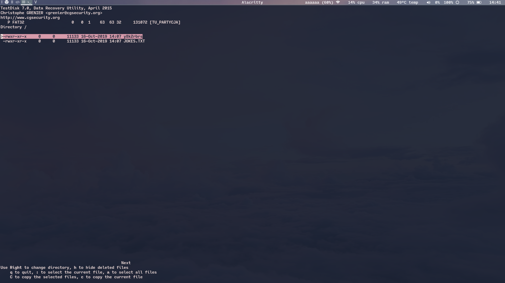

# Zadanie 2.
**fatcat** to niezależnie rozwijane narzędzue (tzn niebędące częścią żadnego z większych
projektów FOSS jak GNU czy linux-utils), które stanowi swego rodzaju nóż uniwersalny
do odczytu i modyfikacji systemów plików FAT.
Wbrew mylącej nazwie, jego zastosowania są o wiele większe niż znanego wszystkim **cat**a,
a nazwa wydaje się mieć [inną inspirację](https://github.com/Gregwar/fatcat/blob/master/docs/fatcat.jpg)
niż ten standardowy unixowy tool.
Składnia poleceń jest dosyć standardowa, choć brak w niej `--długich-opcji`.

Kilka ciekawszych flag i opcji:

- **-i** -> ogólne informacje o FACie obecnym na partycji/dysku

        $> fatcat -i disk-FAT.img
        FAT Filesystem information

        Filesystem type: FAT32
        OEM name: mkfs.fat
        Total sectors: 131072
        Total data clusters: 129152
        Data size: 66125824 (63.0625M)
        Disk size: 67108864 (64M)
        Bytes per sector: 512
        Sectors per cluster: 1
        Bytes per cluster: 512
        Reserved sectors: 32
        Sectors per FAT: 1009
        Fat size: 516608 (504.5K)
        FAT1 start address: 0000000000004000
        FAT2 start address: 0000000000082200
        Data start address: 0000000000100400
        Root directory cluster: 2
        Disk label: TU_PARTYCJA

        Free clusters: 129127/129152 (99.9806%)
        Free sp ace: 66113024 (63.0503M)
        Used space: 12800 (12.5K)

- **-l oraz -L** wyświetlają wpisy w katalogu, na podstawie odpowiednio ścieżki i klastra.
Co ważne, wypisują również informacje o usuniętych plikach! (Przy obecnej fladze **-d**)

        $> fatcat  -d disk-FAT.img -l /
        Listing path /
        Directory cluster: 2
        f 16/10/2019 13:07:50  y8k2rbrs                       c=3 s=11133 (10.8721K) d
        f 16/10/2019 13:07:50  JOKES.TXT                      c=3 s=11133 (10.8721K)

- **-r i -R** odczytują plik o podanej ścieżce/zaczynający się w podanym klastrze,
flaga **-d** również dostępna.

        $> fatcat disk-FAT.img -d -r /JOKES.TXT
        /* treść lepszych i gorszych żartów */

- **-2** wykonuje diffa dwóch FATów - jak pamiętamy, w celu półbackupu FATów jest > 1.
zdaje się jednak, że **fatcat** nie obsługuje większej niż 2 liczby?

        $> fatcat disk-FAT.img -2
        Comparing the FATs

        FATs are exactly equals

- **-m** pozwala zmergować FATy

- **-b** i **-p** odpowiednio zrzucają dump tablicy FAT do pliku i przywracają go

- **-o** szuka sierot

- **-k** wyświetla wpisy w katalogach odnoszące się do wskazanego klastra

        $> fatcat disk-FAT.img -k 3
        Searching for an entry referencing 3 ...
        Found /y8k2rbrs in directory / (0)
        Found /JOKES.TXT in directory / (0)
        f 16/10/2019 13:07:50  JOKES.TXT                      c=3 s=11133 (10.8721K**

# Zadanie 3.
**testdisk** to narzędzie pozwalające na przede wszystkim dwie rzeczy - odnalezienie partycji,
które zostały usunięte z partition table urządzenia (na przykład GPT na dysku twardym),
oraz przejrzenie partycji pod kątem plików, które zostały usunięte.
Poza tym zapewnia również dające się co prawda łatwo zastąpić innymi programami,
jednak wciąż przydatne funkcje takie jak zrzucenie obrazu dysku/partycji i zmiana jej typu.
Na screenshocie widać dwa pliki, spośróð których jeden jest usunięty.
(Właśćiwie odnoszą się do tego samego pliku/klastra, jednak jak widać operacja **mv**
jest tu zaimplementowana w taki sposób).

Z kolei **photorec** jest jego odpowiednikiem działającym na innym poziomie abstrakcji - służy on
do odzyskiwania plików *na konkretnej partycji lub dysku*, całkowicie ignorując
system plików - działa przez tzw data carving, poszukując sygnatur znanych mu formatów plików.
Dzięki temu może pomóc nawet w przypadku zapsutego urządzenia lub uszkodzonego systemu plików.

# Zadanie 5.

- **dyskietka 1** - nienaruszony FAT, plik `<coś>ORADA.GPG`został po prostu oznaczony jako skasowany.
Przez sprytny sposób oznaczania skasowanych plików nie wiadomo jaka była pierwsza litera.

- **dyskietka 2** - ???, nie wiem co się z nią stało i jak ją naprawić :(
Widzę na niej plik JPEG w JFIF, ale jest chyba w nieciągłym łańcuchu klastrów,
bo wycięcie fragmentu który zaczyna się od początku pliku `(FF D8)` do ostatniego mającego
sens segmentu + jego długości (`FF DA` + 2 bajty na długość + 10 bajtów danych) skutkuje
plikiem który ImageMagick określa jako 'premature ended' :(

- **dyskietka 3** - plik BMP bezproblemowo znaleziony przez **photorec**  
  `UHng2ra`

- **dyskietka 4** - kilka łańcuchów osieroconych klastrów, w jednym plik BMP z hasłem  
  `BPqf6a`

- **dyskietka 5**  
  `HjaB4t`

- **dyskietka 6** - znów osierocony łańcuch, złożony z jednego klastra (1379)  
  `u5QamU**

# Zadanie 6

**fatsort** pozwala na posortowanie FSu FAT bezpośrednio we wpisach katalogów.
Dostępne opcje umożliwiają zmianę kryteriów sortowania (czas modyfikacji, alfabetycznie, co ciekawe - losowo) i
ignorowanie bądź whitelistowanie plików i/lub katalogów pasujących do podanych regexów.
Przykładowa sesja:

        ^^/poligon >>> fatcat disk-FAT.img -L 0                                         /home/asgavar/poligon
        Listing cluster 0
        Directory cluster: 0
        f 16/10/2019 13:07:50  JOKES.TXT                      c=3 s=11133 (10.8721K)
        f 6/11/2019 13:15:26  zzz                            c=0 s=0 (0B)
        f 6/11/2019 13:15:30  xxx                            c=0 s=0 (0B)
        f 6/11/2019 13:15:30  aaa                            c=0 s=0 (0B)
        f 6/11/2019 13:15:32  bbb                            c=0 s=0 (0B)
        f 6/11/2019 13:15:34  ddd                            c=0 s=0 (0B)
        f 6/11/2019 13:15:36  ccc                            c=0 s=0 (0B)

        ^^/poligon >>> fatsort disk-FAT.img                                             /home/asgavar/poligon
        File system: FAT32.

        ^^/poligon >>> fatcat disk-FAT.img -L 0                                         /home/asgavar/poligon
        Listing cluster 0
        Directory cluster: 0
        f 6/11/2019 13:15:30  aaa                            c=0 s=0 (0B)
        f 6/11/2019 13:15:32  bbb                            c=0 s=0 (0B)
        f 6/11/2019 13:15:36  ccc                            c=0 s=0 (0B)
        f 6/11/2019 13:15:34  ddd                            c=0 s=0 (0B)
        f 16/10/2019 13:07:50  JOKES.TXT                      c=3 s=11133 (10.8721K)
        f 6/11/2019 13:15:30  xxx                            c=0 s=0 (0B)
        f 6/11/2019 13:15:26  zzz                            c=0 s=0 (0B)

